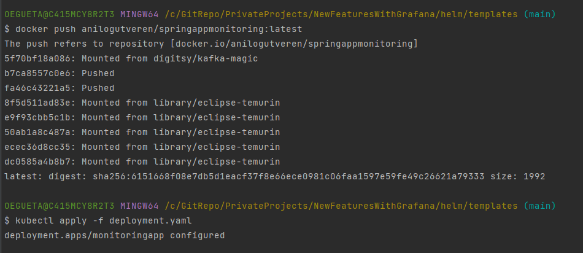
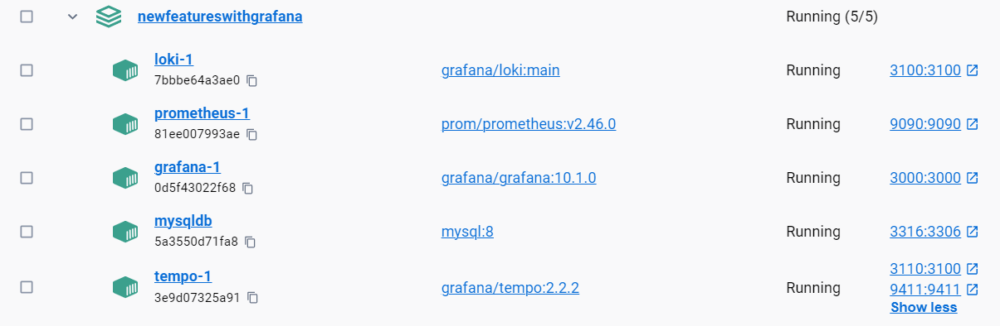

# Spring Boot 3 New Features with Monitoring

Used features:

- Records
- CustomExceptionHandler
- ProblemDetail
- Actuator
- Observability API

## Create docker image

Step -1: Build docker image of the spring boot app 
Dockerfile is in the root of the project.
```shell
docker image build -t anilogutveren/springappmonitoring:latest .
```

I pushed it to remote docker hub. You can use it directly.



Deploy the spring boot application to kubernetes cluster
```shell
cd helm/templates
```
```shell
kubectl apply -f deployment.yaml
```

Optional: Test the container locally
```shell
docker container run -p 8080:8080 --name monitoringapp springappmonitoring
```
## How to observe with actuator
Make some calls to endpoints firstly --> http://localhost:8080/microphone/all
    
Then go to http://localhost:8080/actuator/metrics/getAllDrumMics


## Start Prometheus with Grafana (Loki and Tempo) on Docker

```shell
docker-compose up
```



Go to http://localhost:3000 for grafana dashboard

To be able to see grafana dashboard, you need to add logs. So send some requests to the endpoints.
Guide: https://programmingtechie.com/2023/09/09/spring-boot3-observability-grafana-stack/

## Start Prometheus with Grafana on Minikube K8 Cluster (Optional)

We can also start Prometheus and Grafana on the minikube K8 cluster.
Note!: This does not include grafana-loki

https://github.com/aytitech/k8sfundamentals/blob/main/monitoring/kube-prometheus-stack.md

```shell
helm repo add prometheus-community https://prometheus-community.github.io/helm-charts
```
```shell
helm repo update
```
```shell
helm install kubeprostack --namespace monitoring prometheus-community/kube-prometheus-stack
```
Check the rest commands in the link above.